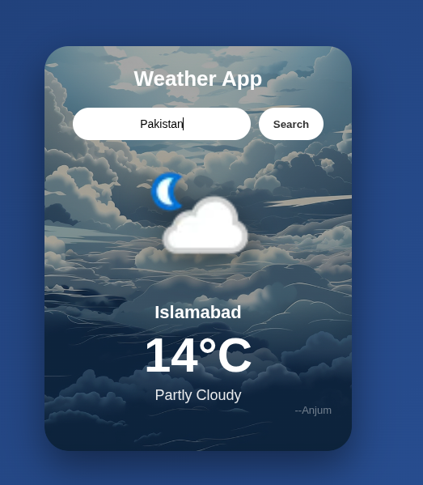

<h1>🌦️ Weather App</h1>

  A <strong>modern, responsive Weather App</strong> built using
  <strong>HTML, CSS, and JavaScript</strong>, powered by
  <strong>WeatherAPI</strong>.
   
  This project demonstrates real-world frontend development, API integration,
  and clean UI design.

<h1>🛠️ Technologies Used</h1>

<ul>
  <li><strong>HTML5</strong></li>
  <li><strong>CSS3</strong> (Flexbox, Media Queries, Animations)</li>
  <li><strong>JavaScript (ES6+)</strong></li>
  <li><strong>WeatherAPI</strong> (Current weather data)</li>
</ul>

<h1>📂 Project Structure</h1>

<pre>
weather-app/
│
├── images/
│   ├── background.jpg
│   └── suncl.png
│
├── index.html
├── style.css
├── index.js
└── README.md
</pre>

<h1>⚙️ How It Works</h1>

<ul>
  <li>User enters a <strong>city name</strong></li>
  <li>App sends a request to <strong>WeatherAPI</strong></li>
  <li>Weather data is fetched asynchronously using <strong>fetch()</strong></li>
  <li>
    UI updates dynamically:
    <ul>
      <li><strong>City name</strong></li>
      <li><strong>Temperature (°C)</strong></li>
      <li><strong>Weather condition</strong></li>
      <li><strong>Dynamic weather icon</strong></li>
    </ul>
  </li>
</ul>

<h1>🔑 API Used</h1>

<h2>WeatherAPI</h2>

<strong>Endpoint:</strong>

<pre>
https://api.weatherapi.com/v1/current.json
</pre>

  You need a <strong>free API key</strong> from:
   
  👉 <a href="https://www.weatherapi.com/" target="_blank">https://www.weatherapi.com/</a>

<h1>🧪 Example API Response Fields Used</h1>

<ul>
  <li><code>location.name</code></li>
  <li><code>current.temp_c</code></li>
  <li><code>current.condition.text</code></li>
  <li><code>current.condition.icon</code></li>
</ul>

<h1>📱 Responsive Design</h1>

<ul>
  <li><strong>Mobile-first layout</strong></li>
  <li><strong>Flexible container sizing</strong></li>
  <li><strong>Touch-friendly inputs and buttons</strong></li>
  <li><strong>Optimized for mobile, tablet, and desktop</strong></li>
</ul>

<h1>🧠 What I Learned</h1>

<ul>
  <li>Working with <strong>REST APIs</strong></li>
  <li>Handling async JavaScript using <strong>async / await</strong></li>
  <li><strong>DOM manipulation</strong></li>
  <li>Building <strong>responsive UIs</strong></li>
  <li>Debugging <strong>file paths & assets</strong></li>
  <li>Real-world <strong>frontend workflow</strong></li>
</ul>

<h1>🌟 Future Improvements</h1>

<ul>
  <li>🌙 Day / Night mode</li>
  <li>🌧️ Weather-based background changes</li>
  <li>📅 3-day or 7-day forecast</li>
  <li>⏳ Loading & error handling UI</li>
  <li>💾 Save last searched city</li>
</ul>

<h1>📸 Preview</h1>

<h1>📄 License</h1>

This project is <strong>open-source</strong> and free to use.

<h1>🙌 Author</h1>

<h2>Adnan Anjum</h2>

  Learning & building with <strong>JavaScript</strong> 🚀

